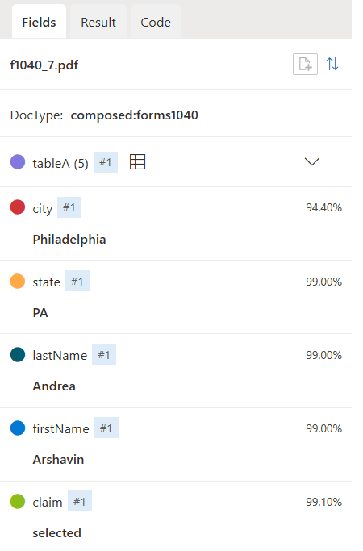
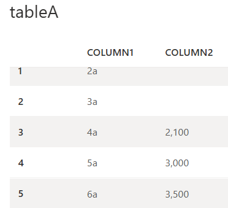

# Results of running the composed models

Notice the `docType`. It is used to indicate which model is *actually* used for analysis.

Table is the form is also extracted.

[Test file](https://github.com/MicrosoftLearning/mslearn-ai-document-intelligence/blob/main/Labfiles/03-composed-model/trainingdata/TestDoc/f1040_7.pdf) in GitHub (PDF)