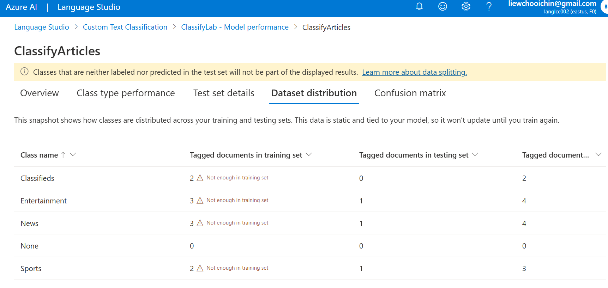

# Test results of `classify-text.py`

```
python classify-text.py
test1.txt was classified as 'Entertainment' with confidence score 0.33.
test2.txt was classified as 'Sports' with confidence score 0.33.
test3.txt was classified as 'Entertainment' with confidence score 0.28.
```

## Observation

The confidence score is rather low. This might be caused by low number of training data. Below shows the [training distribution](./data_distribution.png) from Azure Language Studio.




