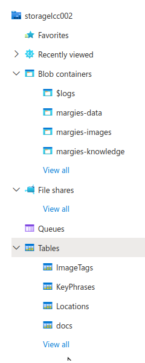
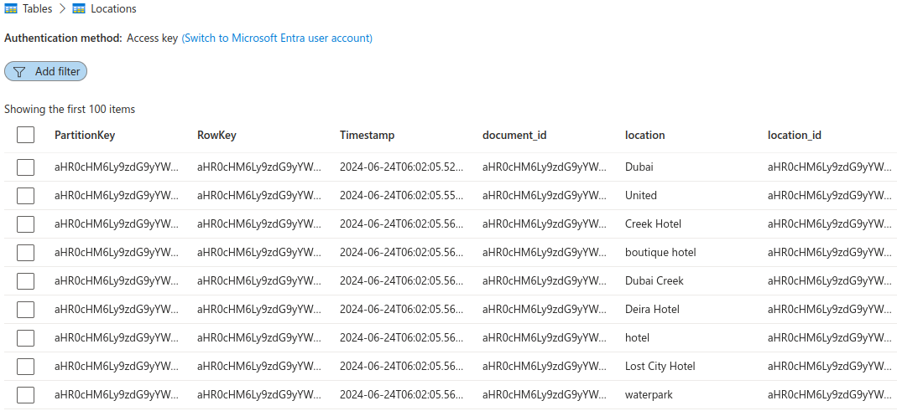
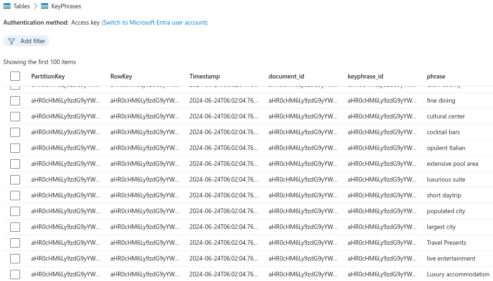
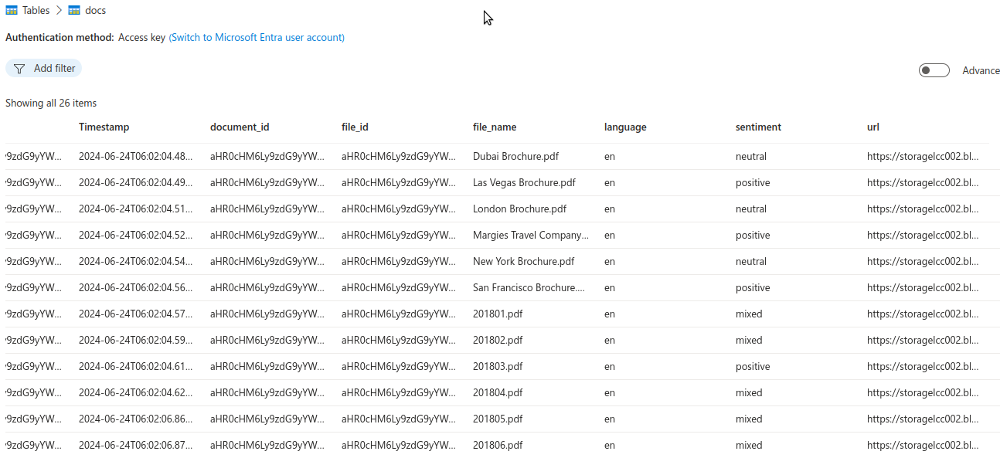
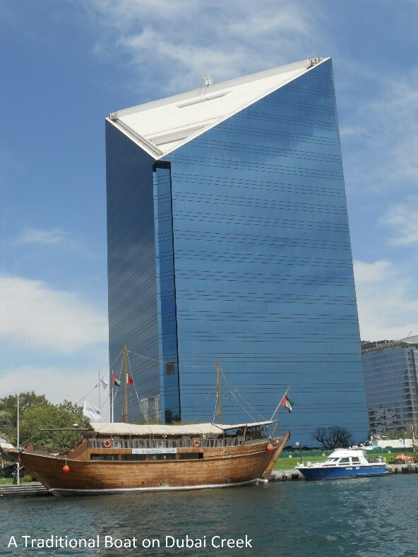

# Results of the knowledge store lab

Go to **Azure Storage Browser**, **Blob containers** to see the objects created.

Go to **Azure Storage Browser**, **Tables** to see the objects created.

The followings are created.

Knowledge projection for one of the file: `"file_name": "Dubai Brochure.pdf",` is in `pretty_out.json`.

The `location` table looks like this in the **Storage Browser--Table**.

The `key phrases` table looks like this in the **Storage Browser--Table**.

The `docs` table looks like this in the **Storage Browser--Table**. The `docs` contains file names, language, sentiment and url.

The images are stored in `margies-images`.

Some images look like this:

